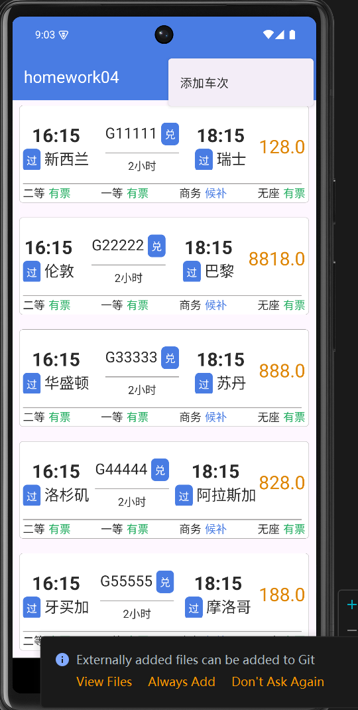
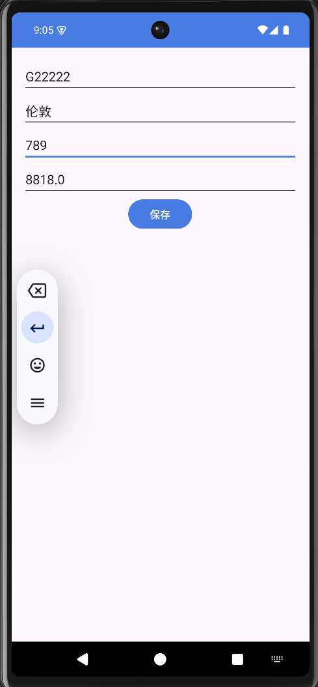
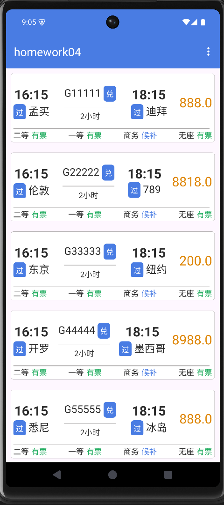
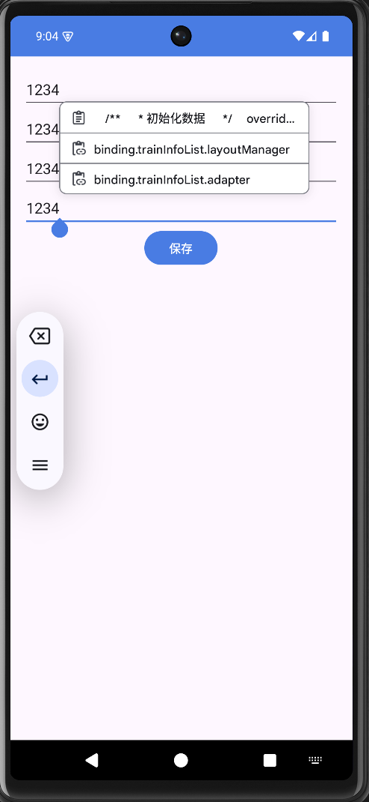
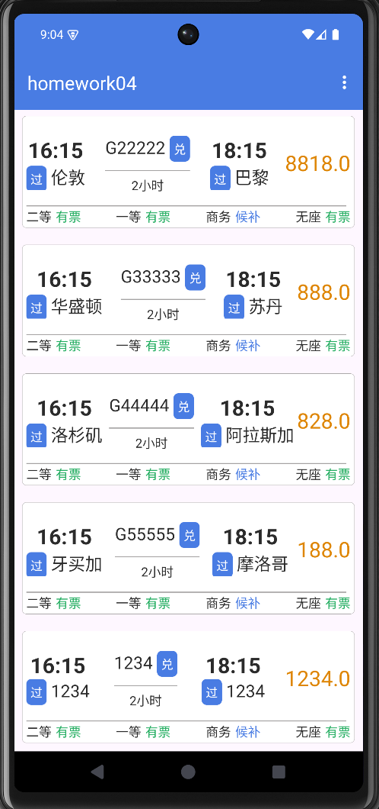

## 一、修改列车信息

### 1. 创建修改列车信息的布局

首先，创建一个新的布局文件 `activity_edit_train_info.xml`，用于修改列车信息。

```xml
<!-- res/layout/activity_edit_train_info.xml -->
<LinearLayout xmlns:android="http://schemas.android.com/apk/res/android"
    android:layout_width="match_parent"
    android:layout_height="match_parent"
    android:orientation="vertical"
    android:padding="16dp">

    <EditText
        android:id="@+id/edit_train_name"
        android:layout_width="match_parent"
        android:layout_height="wrap_content"
        android:hint="列车名称" />

    <EditText
        android:id="@+id/edit_train_start"
        android:layout_width="match_parent"
        android:layout_height="wrap_content"
        android:hint="出发地" />

    <EditText
        android:id="@+id/edit_train_end"
        android:layout_width="match_parent"
        android:layout_height="wrap_content"
        android:hint="目的地" />

    <EditText
        android:id="@+id/edit_train_price"
        android:layout_width="match_parent"
        android:layout_height="wrap_content"
        android:hint="票价" />

    <Button
        android:id="@+id/button_save"
        android:layout_width="wrap_content"
        android:layout_height="wrap_content"
        android:text="保存" />
</LinearLayout>
```

### 2. 创建修改列车信息的活动

接下来，创建一个新的活动 `EditTrainInfoActivity`，用于处理列车信息的编辑。

```kotlin
// EditTrainInfoActivity.kt
package com.lytton.androidcourse.components

import android.app.Activity
import android.content.Intent
import android.os.Bundle
import android.widget.Button
import android.widget.EditText
import androidx.appcompat.app.AppCompatActivity
import com.lytton.androidcourse.R
import com.lytton.androidcourse.entity.TrainInfo

class EditTrainInfoActivity : AppCompatActivity() {

    private lateinit var editTrainName: EditText
    private lateinit var editTrainStart: EditText
    private lateinit var editTrainEnd: EditText
    private lateinit var editTrainPrice: EditText

    override fun onCreate(savedInstanceState: Bundle?) {
        super.onCreate(savedInstanceState)
        setContentView(R.layout.activity_edit_train_info)

        editTrainName = findViewById(R.id.edit_train_name)
        editTrainStart = findViewById(R.id.edit_train_start)
        editTrainEnd = findViewById(R.id.edit_train_end)
        editTrainPrice = findViewById(R.id.edit_train_price)
        val buttonSave: Button = findViewById(R.id.button_save)

        // 获取传递的数据
        val trainInfo: TrainInfo? = intent.getParcelableExtra("trainInfo")
        trainInfo?.let {
            editTrainName.setText(it.name)
            editTrainStart.setText(it.start)
            editTrainEnd.setText(it.end)
            editTrainPrice.setText(it.price.toString())
        }

        buttonSave.setOnClickListener {
            val updatedTrainInfo = TrainInfo(
                editTrainName.text.toString(),
                editTrainStart.text.toString(),
                editTrainEnd.text.toString(),
                editTrainPrice.text.toString().toDoubleOrNull() ?: 0.0
            )

            val resultIntent = Intent().apply {
                putExtra("updatedTrainInfo", updatedTrainInfo)
            }
            setResult(Activity.RESULT_OK, resultIntent)
            finish()
        }
    }
}
```

### 3. 更新 `TrainInfoListActivity` 实现点击事件

在 `TrainInfoListActivity` 中，添加点击事件以启动 `EditTrainInfoActivity` 并接收返回的数据。

```kotlin
import android.content.Intent
import android.os.Bundle
import androidx.activity.result.contract.ActivityResultContracts
import androidx.recyclerview.widget.RecyclerView

class TrainInfoListActivity : BaseViewModelActivity<ActivityTrainInfoListBinding>() {

    // 省略其他代码...

    override fun initDatum() {
        super.initDatum()

        // 初始化列车信息
        trainInfoList = listOf(
            // 省略初始化代码...
        )

        binding.trainInfoList.layoutManager = LinearLayoutManager(this)
        trainInfoListAdapter = TrainInfoListAdapter(trainInfoList, object : OnTrainClickListener {
            override fun onTrainClick(trainInfo: TrainInfo) {
                val intent = Intent(this@TrainInfoListActivity, EditTrainInfoActivity::class.java).apply {
                    putExtra("trainInfo", trainInfo)
                }
                editTrainInfoLauncher.launch(intent)
            }
        })
        binding.trainInfoList.adapter = trainInfoListAdapter
    }

    private val editTrainInfoLauncher =
        registerForActivityResult(ActivityResultContracts.StartActivityForResult()) { result ->
            if (result.resultCode == Activity.RESULT_OK) {
                result.data?.let { data ->
                    val updatedTrainInfo = data.getParcelableExtra<TrainInfo>("updatedTrainInfo")
                    updatedTrainInfo?.let {
                        // 更新列车信息列表
                        val position = trainInfoList.indexOfFirst { it.name == it.name }
                        if (position != -1) {
                            trainInfoList[position] = it
                            trainInfoListAdapter.notifyItemChanged(position)
                        }
                    }
                }
            }
        }

    interface OnTrainClickListener {
        fun onTrainClick(trainInfo: TrainInfo)
    }

    class TrainInfoListAdapter(
        private val trainInfoList: MutableList<TrainInfo>,
        private val listener: OnTrainClickListener
    ) : RecyclerView.Adapter<TrainInfoListAdapter.TrainViewHolder>() {
        // 省略其他代码...

        override fun onBindViewHolder(holder: TrainViewHolder, position: Int) {
            val currentTrain = trainInfoList[position]
            holder.name.text = currentTrain.name
            holder.start.text = currentTrain.start
            holder.end.text = currentTrain.end
            holder.price.text = currentTrain.price.toString()

            holder.itemView.setOnClickListener {
                listener.onTrainClick(currentTrain)
            }
        }
    }
}
```

### 4. 确保 `TrainInfo` 支持 Parcelable

如果 `TrainInfo` 还没有实现 `Parcelable` 接口，请确保它实现了该接口，以便在活动之间传递对象。

```kotlin
// TrainInfo.kt
import android.os.Parcel
import android.os.Parcelable

data class TrainInfo(
    val name: String,
    val start: String,
    val end: String,
    val price: Double
) : Parcelable {
    constructor(parcel: Parcel) : this(
        parcel.readString() ?: "",
        parcel.readString() ?: "",
        parcel.readString() ?: "",
        parcel.readDouble()
    )

    override fun writeToParcel(parcel: Parcel, flags: Int) {
        parcel.writeString(name)
        parcel.writeString(start)
        parcel.writeString(end)
        parcel.writeDouble(price)
    }

    override fun describeContents(): Int {
        return 0
    }

    companion object CREATOR : Parcelable.Creator<TrainInfo> {
        override fun createFromParcel(parcel: Parcel): TrainInfo {
            return TrainInfo(parcel)
        }

        override fun newArray(size: Int): Array<TrainInfo?> {
            return arrayOfNulls(size)
        }
    }
}
```

|  |  |  |
| ----------------------------------- | -------------------- | -------------------- |


## 二、添加列车信息。

### 1. 在 `TrainInfoListActivity` 中添加菜单项

首先，我们需要重写 `onCreateOptionsMenu` 和 `onOptionsItemSelected` 方法，以便添加菜单项和处理点击事件。

```kotlin
override fun onCreateOptionsMenu(menu: Menu?): Boolean {
    menuInflater.inflate(R.menu.menu_main, menu) // 加载菜单资源
    return true
}

override fun onOptionsItemSelected(item: MenuItem): Boolean {
    return when (item.itemId) {
        R.id.action_add -> {
            // 点击添加选项时，启动添加车次信息的窗口
            val intent = Intent(this, EditTrainInfoActivity::class.java)
            startActivityForResult(intent, REQUEST_CODE_ADD_TRAIN)
            true
        }
        else -> super.onOptionsItemSelected(item)
    }
}
```

### 2. 创建菜单资源文件

接下来，您需要在 `res/menu` 目录下创建一个菜单资源文件 `menu_main.xml`，内容如下：

```xml
<menu xmlns:android="http://schemas.android.com/apk/res/android">
    <item
        android:id="@+id/action_add"
        android:title="添加车次"
        android:orderInCategory="100"
        android:showAsAction="never" />
</menu>
```

### 3. 创建添加车次信息的窗口

我们需要创建一个 `EditTrainInfoActivity` 用于添加和编辑车次信息。这个活动将复用之前的布局 `activity_edit_train_info.xml`。以下是 `EditTrainInfoActivity` 的实现示例：

```kotlin
class EditTrainInfoActivity : AppCompatActivity() {
    private lateinit var binding: ActivityEditTrainInfoBinding

    override fun onCreate(savedInstanceState: Bundle?) {
        super.onCreate(savedInstanceState)
        binding = ActivityEditTrainInfoBinding.inflate(layoutInflater)
        setContentView(binding.root)

        // 检查是否有传入的车次信息
        val trainInfo = intent.getParcelableExtra<TrainInfo>("trainInfo")
        if (trainInfo != null) {
            // 如果有，则填充数据以进行编辑
            binding.editTrainName.setText(trainInfo.name)
            binding.editTrainStart.setText(trainInfo.start)
            binding.editTrainEnd.setText(trainInfo.end)
            binding.editTrainPrice.setText(trainInfo.price.toString())
        }

        // 保存按钮的点击事件
        binding.buttonSave.setOnClickListener {
            val newTrainInfo = TrainInfo(
                binding.editTrainName.text.toString(),
                binding.editTrainStart.text.toString(),
                binding.editTrainEnd.text.toString(),
                binding.editTrainPrice.text.toString().toDoubleOrNull() ?: 0.0
            )

            // 返回结果
            val data = Intent().apply {
                putExtra("updatedTrainInfo", newTrainInfo)
            }
            setResult(Activity.RESULT_OK, data)
            finish() // 关闭当前活动
        }
    }
}
```

### 4. 在 `TrainInfoListActivity` 中处理添加的结果

在 `TrainInfoListActivity` 中，我们需要处理从 `EditTrainInfoActivity` 返回的结果，并将新的车次信息添加到列表中：

```kotlin
private val REQUEST_CODE_ADD_TRAIN = 1

override fun onActivityResult(requestCode: Int, resultCode: Int, data: Intent?) {
    super.onActivityResult(requestCode, resultCode, data)
    if (requestCode == REQUEST_CODE_ADD_TRAIN && resultCode == Activity.RESULT_OK) {
        data?.let {
            val newTrainInfo = it.getParcelableExtra<TrainInfo>("updatedTrainInfo")
            newTrainInfo?.let { trainInfo ->
                // 将新的车次信息添加到列表
                trainInfoList.add(trainInfo)
                trainInfoListAdapter.notifyItemInserted(trainInfoList.size - 1)
            }
        }
    }
}
```

### 5. 确保 `TrainInfo` 类实现 `Parcelable` 接口

确保您的 `TrainInfo` 类实现了 `Parcelable` 接口，以便在意图之间传递数据。

```kotlin
import android.os.Parcel
import android.os.Parcelable

data class TrainInfo(
    val name: String,
    val start: String,
    val end: String,
    val price: Double
) : Parcelable {
    constructor(parcel: Parcel) : this(
        parcel.readString() ?: "",
        parcel.readString() ?: "",
        parcel.readString() ?: "",
        parcel.readDouble()
    )

    override fun writeToParcel(parcel: Parcel, flags: Int) {
        parcel.writeString(name)
        parcel.writeString(start)
        parcel.writeString(end)
        parcel.writeDouble(price)
    }

    override fun describeContents(): Int {
        return 0
    }

    companion object CREATOR : Parcelable.Creator<TrainInfo> {
        override fun createFromParcel(parcel: Parcel): TrainInfo {
            return TrainInfo(parcel)
        }

        override fun newArray(size: Int): Array<TrainInfo?> {
            return arrayOfNulls(size)
        }
    }
}
```

|  |  |  |
| ---------------------- | -------------------- | -------------------- |

